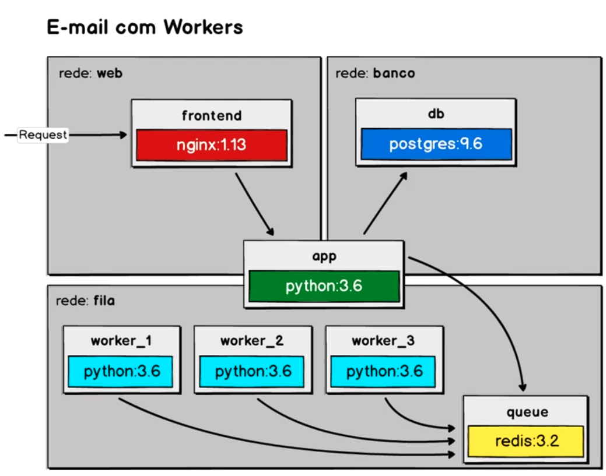
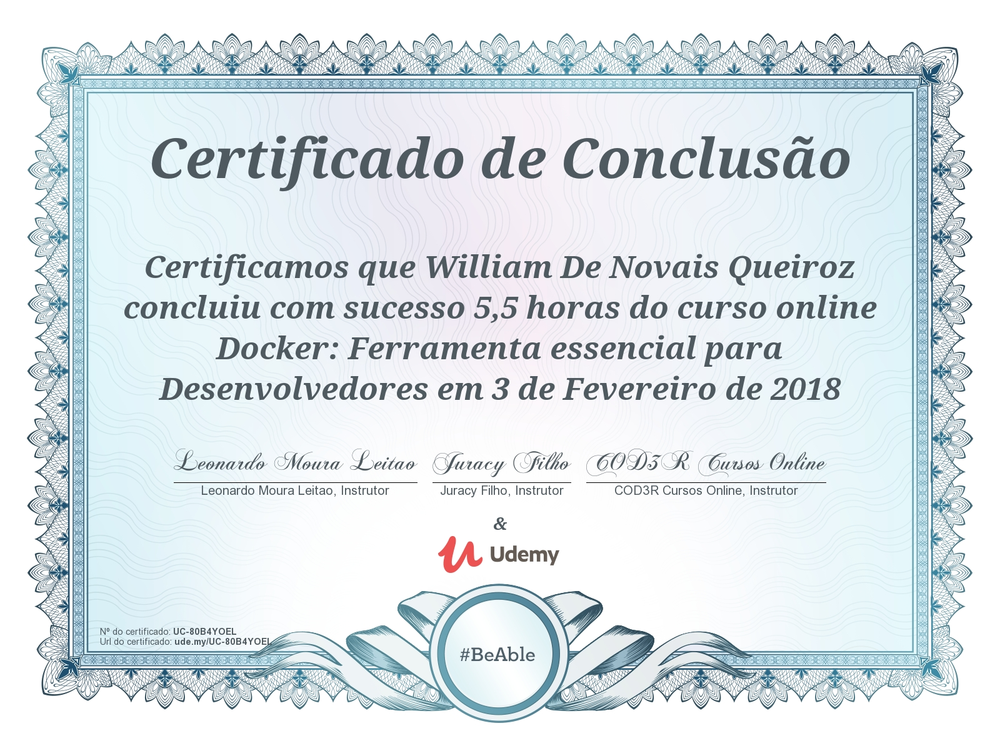

# Curso: Docker: Ferramenta essencial para desenvolvedores | Udemy

Esse repositório contempla os projetos e estudos abordados no curso [Docker: Ferramenta essencial para desenvolvedores](https://www.udemy.com/curso-docker/)

### Building Apps With Docker

On directory: `docker-compose up -d`  

### Applications Structures 

  
  

Access in: [http://localhost](http://localhost)

> NOTE: You need have docker installed

### Course Certificate

  

